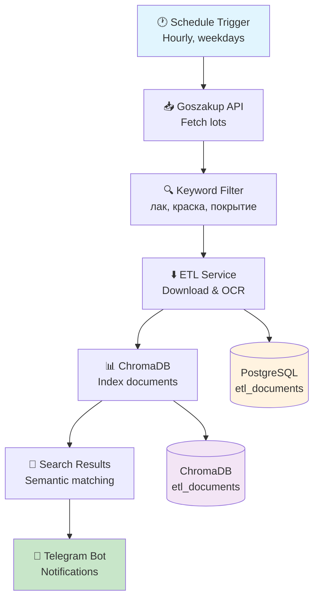
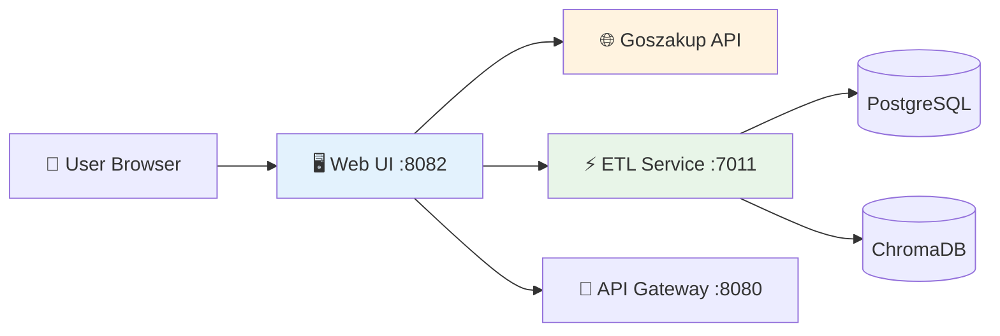

[](https://github.com/Yevgen-beep/zakupai/actions/workflows/ci.yml)

# ZakupAI

MVP-платформа для автоматизации госзакупок РК.
ZakupAI анализирует тендеры, генерирует краткие TL;DR, оценивает риски и маржинальность, формирует документы и жалобы, а также интегрируется с n8n, Flowise и Telegram-ботом для бизнеса.

______________________________________________________________________

## 🚀 Возможности

- Автоматический разбор тендеров (TL;DR, риск-скоринг, маржа, НДС, штрафы)
- Генерация документов: письма, жалобы, отчёты (PDF/HTML)
- **🆕 Интеллектуальный поиск лотов** с GraphQL v2 и REST v3 API
- **🆕 Система логирования пользователей** с автоочисткой и аналитикой
- **🆕 Расширенная аналитика и метрики** — отслеживание популярных запросов, пользовательской активности
- **🆕 Автоматическая очистка базы данных** — интеллектуальная ротация логов по времени и размеру
- Telegram-бот @TenderFinderBot_bot как основной интерфейс для МСБ
- Интеграции: Flowise (визуальные AI-воркфлоу), n8n (автоматизация процессов)
- Мониторинг конкурентов и «горячие лоты» (уведомления по cron)
- Финансовый калькулятор для оценки выгодности участия

______________________________________________________________________

## 🏗 Архитектура

ZakupAI построен на микросервисной архитектуре (FastAPI + Docker).

### Основные сервисы

- **API Gateway** (`http://localhost:8080`) — маршрутизация, rate limits, X-API-Key
- **Billing Service** (`:7004`) — управление пользователями, API ключи, лимиты, подписки
- **Calc Service** (`:7001`) — расчёты (НДС, маржа, штрафы)
- **Risk Engine** (`:7002`) — риск-скоринг и объяснения
- **Doc Service** (`:7003`) — TL;DR, письма, PDF-экспорт, локализация (ru/kz/en)
- **Embedding API** (`:7010`) — векторизация, поиск, интеграция с Ollama

### Базы данных

- **PostgreSQL** (`:5432`) — лоты, цены, риски, финрезультаты + billing схема (users, api_keys, usage, payments)
- **ChromaDB** (`:8000`) — векторное хранилище для поиска

### Клиентские интерфейсы

- **Telegram Bot** (@TenderFinderBot_bot)
  - `/start` — приветствие + регистрация
  - `/key <API_KEY>` — привязка ключа
  - `/lot <id|url>` — полный анализ лота
  - `/search <запрос>` — поиск лотов по ключевым словам
  - `/help` — справка
  - **🆕 Команды аналитики:**
    - `/analytics` — системная статистика за 7 дней
    - `/popular` — топ популярных запросов
    - `/mystats` — персональная статистика пользователя
  - **🆕 Админские команды:**
    - `/cleanup [дни]` — очистка логов старше N дней
    - `/dbinfo` — информация о размере и состоянии базы данных
    - `/autocleanup [размер_MB]` — автоочистка при превышении размера
- **Web UI** (`http://localhost:8082`) — просмотр лотов, загрузка прайсов (CSV/XLSX)
- **Flowise** (`http://localhost:3000`) — AI-воркфлоу (lot-reader, risk-explain, finance-calc, template-gen)
- **n8n** (`http://localhost:5678`) — автоматизация и пайплайны

### Мониторинг и DevOps

- **Prometheus** (`http://localhost:9090`) — метрики
- **Grafana** (`http://localhost:3001`) — дашборды
- **Alertmanager** (`http://localhost:9093`) — алерты
- **cAdvisor** (`http://localhost:8081`) — контейнеры
- **Node Exporter** (`:9100`) и **BlackBox Exporter** (`:9115`) — метрики хоста и HTTP
- Автобэкапы PostgreSQL (pg_dump + rclone → B2/S3)
- CI/CD (lint, build, smoke-тесты)

### 🛡️ Безопасность

**Конфигурация:**

- Все секреты загружаются из `.env` файлов (пароли, API ключи, токены)
- Обязательные переменные окружения валидируются при запуске
- Никогда не логируем API ключи или пароли (только маскированные версии)

**База данных:**

- Connection pooling с ограничениями (min/max соединения, таймауты)
- Параметризованные SQL запросы для защиты от инъекций
- Валидация входных данных с помощью Pydantic моделей
- Автоматическое закрытие соединений через контекстные менеджеры

**HTTP и API:**

- SSL verification включен по умолчанию для всех внешних запросов
- Request/Response логирование с уникальными X-Request-Id
- Таймауты для всех HTTP запросов (защита от зависания)
- Централизованная обработка ошибок без утечки технических деталей

**Telegram Bot:**

- Rate limiting: максимум 10 команд в минуту на пользователя
- Валидация и санитизация всех пользовательских вводов
- Безопасная обработка URL и ID лотов (защита от XSS)
- Логирование событий безопасности (превышения лимитов, подозрительные вводы)

**Валидация данных:**

- Строгая типизация с Pydantic для всех API моделей
- Ограничение размеров входных данных (защита от DoS)
- Email валидация по RFC стандартам
- UUID формат для API ключей с проверкой

**Monitoring безопасности:**

- Логирование всех security events с уровнем WARNING
- Отслеживание неудачных попыток авторизации
- Мониторинг превышений rate limits
- Централизованное логирование без секретов

### AI и Ollama

- **Ollama (host)** (`http://localhost:11434`)
- Модели: `qwen3`, `llama3`, `mistral`, `deepseek-r1`
- Используется для эмбеддингов и LLM-обработки

### 📊 Система аналитики и метрик

**🆕 Пользовательские метрики:**

- SQLite база данных для хранения логов поисковых запросов
- Автоматическое логирование всех операций поиска с временными метками
- Отслеживание успешности запросов, времени выполнения, используемых API
- Статистика по пользователям: количество поисков, уникальные запросы, частота использования

**🆕 Аналитические возможности:**

- Популярные поисковые запросы за любой период (топ-10)
- Системная статистика: общее количество поисков, активные пользователи, успешность
- Персональная аналитика: индивидуальная статистика каждого пользователя
- Мониторинг ошибок и проблем в поисковых запросах
- Анализ производительности различных API (GraphQL v2 vs REST v3)

**🆕 Автоматическая очистка базы данных:**

- Интеллектуальная ротация логов на основе времени и размера базы
- Стратегии очистки:
  - < 50 MB: стандартная очистка (90 дней)
  - 50-100 MB: умеренная очистка (60 дней)
  - \> 100 MB: агрессивная очистка (30 дней)
- Автоматическая VACUUM оптимизация для освобождения дискового пространства
- Cron скрипт для еженедельной автоматической очистки

**🆕 Telegram команды для мониторинга:**

- `/analytics` — системная статистика за 7 дней
- `/popular [дни]` — популярные запросы за период
- `/mystats [дни]` — персональная статистика пользователя
- `/cleanup [дни]` — ручная очистка логов (админы)
- `/dbinfo` — информация о размере и состоянии базы (админы)
- `/autocleanup [МБ]` — автоочистка при превышении размера (админы)

**📁 Файлы системы:**

- `bot/user_metrics.py` — основной сервис метрик и очистки
- `bot/analytics_service.py` — форматирование отчетов для Telegram
- `cleanup_logs.py` — скрипт автоматической очистки через cron
- `docs/LOG_CLEANUP.md` — подробная документация системы очистки

______________________________________________________________________

### 🔗 Потоки данных

````mermaid
flowchart LR
    TG[Telegram Bot] -->|/key /lot|
    B[Billing Service]
    W[Web UI] --> B
    F[⚡ Flowise] --> B
    N[n8n Workflows] --> B

    B --> G[API Gateway]

    G --> C[Calc Service]
    G --> R[Risk Engine]
    G --> D[Doc Service]
    G --> E[Embedding API]

    E --> O[Ollama (host)]
    G --> DB[(PostgreSQL)]
    E --> CH[(ChromaDB)]

🔑 Billing Service
MVP (Stage)
PostgreSQL (схема billing):
users — пользователи
api_keys — API-ключи и планы
usage — статистика использования
payments — оплаты и подписки

FastAPI endpoints:
POST /billing/create_key — создать API-ключ (автоматически при /start)
POST /billing/validate_key — валидация ключа + проверка лимитов
POST /billing/usage — логирование использования
GET /billing/stats/{tg_id} — статистика по пользователю

Система лимитов:
Free: 100 запросов/день, 20/час
Premium: 5000 запросов/день, 500/час
Docker: сервис работает на :7004, интегрирован в общий docker-compose

Тарифы
План	                Лимит в день	   Лимит в час	        Цена
Free	                    100	              20	            0 ₸
Premium	                  5000	            500	            10 000 ₸


Интеграция
Telegram Bot: выдаёт ключи и проверяет их перед анализом лота
Gateway: проверяет ключи перед доступом к API
Все сервисы ZakupAI: работают только через Billing валидацию

Сводка по портам
Gateway — http://localhost:8080
Web UI — http://localhost:8082 (интегрирован с goszakup-api)
Telegram Bot — @TenderFinderBot_bot
Flowise — http://localhost:3000
n8n — http://localhost:5678
Postgres — :5432
ChromaDB — :8000
Calc Service — :7001
Risk Engine — :7002
Doc Service — :7003
Billing Service — :7004
Goszakup API — :7005 (внутренний сервис для работы с ГосЗакуп)
ETL Service — :7011 (обработка документов и OCR)
Embedding API — :7010
Ollama (host) — http://localhost:11434
Prometheus — http://localhost:9090
Grafana — http://localhost:3001
Alertmanager — http://localhost:9093
cAdvisor — http://localhost:8081
Node Exporter — http://localhost:9100
BlackBox Exporter — http://localhost:9115

Security & DevOps
Rate limits: 60 req/min (Nginx Gateway)
X-API-Key для всех сервисов
CORS/CSRF политика: dev — открытая, stage — ограниченная, prod — строгая
Валидация входных данных (FastAPI deps)
Pre-commit хуки: ruff, black, isort, yamllint, mdformat
SAST (Bandit) в CI
Автобэкапы PostgreSQL (pg_dump + rclone → B2/S3)

Монетизация
Freemium → Premium подписка (10 000 ₸/мес)
Пакеты документов (3 000–10 000 ₸ за комплект)
AI-отчёты PDF для анализа тендеров
White Label для юристов и консалтинговых компаний

Виды деятельности (ОКЭД)
62.01.1 — Разработка ПО и SaaS (основной)
62.01.2 — ИТ-консалтинг, внедрение ИИ
63.11.1 — Обработка данных, API сервисы
62.03.0 — MLOps и инфраструктура
62.09.0 — Инновационные IT-решения

## 🚀 Быстрый запуск

### 1. Подготовка окружения
```bash
# Склонировать репозиторий
git clone <repo_url>
cd zakupai

# Скопировать конфигурационные файлы
cp .env.example .env
cp bot/.env.example bot/.env

# Настройка Goszakup API Token (обязательно для Web UI)
# Получите токен на https://ows.goszakup.gov.kz
# Обновите GOSZAKUP_TOKEN в .env
````

### 2. Настройка Telegram Bot (обязательно)

Отредактируйте файл `bot/.env`:

```bash
# Получите токен от @BotFather в Telegram
TELEGRAM_BOT_TOKEN=your_bot_token_here

# Для разработки (по умолчанию)
ENVIRONMENT=development

# Для production добавьте webhook настройки
TELEGRAM_WEBHOOK_URL=https://your-domain.com/webhook/telegram
TELEGRAM_WEBHOOK_SECRET=your_webhook_secret
```

### 3. Запуск сервисов

```bash
# Запустить все сервисы
docker-compose up -d

# Проверить статус
docker-compose ps

# Посмотреть логи бота
docker-compose logs -f zakupai-bot
```

### 4. Проверка конфигурации

```bash
# Проверить переменные окружения бота
docker exec zakupai-bot env | grep TELEGRAM

# Проверить webhook (если настроен)
curl -s "https://api.telegram.org/bot${TELEGRAM_BOT_TOKEN}/getWebhookInfo" | python3 -m json.tool

# Проверить API Gateway
curl http://localhost:8080/health
```

### 5. Тестирование бота

1. Найдите вашего бота в Telegram по токену
1. Отправьте `/start`
1. Попробуйте команды `/help`, `/search компьютеры`

______________________________________________________________________

## 📚 Документация по настройке

### Режимы работы бота

**Development (polling):**

- `ENVIRONMENT=development` в `bot/.env`
- Бот работает через polling (запрашивает обновления)
- Подходит для локальной разработки

**Production (webhook):**

- `ENVIRONMENT=production` или `staging` в `bot/.env`
- Настройте `TELEGRAM_WEBHOOK_URL` и `TELEGRAM_WEBHOOK_SECRET`
- Telegram отправляет обновления на ваш сервер
- Более эффективно для production

### Переменные окружения

Основные файлы конфигурации:

- `.env` — общие настройки (БД, API, мониторинг)
- `bot/.env` — настройки Telegram бота

**Критические переменные в bot/.env:**

```bash
TELEGRAM_BOT_TOKEN=       # Токен от @BotFather
TELEGRAM_WEBHOOK_URL=     # URL для webhook (production)
TELEGRAM_WEBHOOK_SECRET=  # Секрет для webhook (production)
ENVIRONMENT=              # development/staging/production
N8N_WEBHOOK_URL=         # URL n8n для поиска лотов
```

### Устранение проблем

**Бот не отвечает:**

```bash
# Проверьте переменные
docker exec zakupai-bot env | grep TELEGRAM_BOT_TOKEN

# Проверьте логи
docker-compose logs zakupai-bot

# Перезапустите бота
docker-compose restart zakupai-bot
```

**Ошибка "Missing required environment variables: TELEGRAM_BOT_TOKEN":**

- Убедитесь, что файл `bot/.env` существует
- Проверьте, что в нем есть `TELEGRAM_BOT_TOKEN=ваш_токен`
- Перезапустите контейнер: `docker-compose restart zakupai-bot`

**База данных недоступна:**

```bash
# Запустите БД отдельно
docker-compose up -d db

# Дождитесь готовности (~30 секунд)
docker-compose logs db

# Запустите бота
docker-compose up -d zakupai-bot
```

______________________________________________________________________

## Testing OCR & Search (Sprint 2)

В Спринте 2 реализован полнофункциональный OCR pipeline с автоматическими миграциями БД и интеграцией ChromaDB для семантического поиска. Система обрабатывает PDF документы с кириллическим текстом, сохраняет в PostgreSQL и индексирует в ChromaDB для быстрого поиска.

Команды проверяют: Alembic миграции, OCR обработку PDF/ZIP файлов, сохранение в БД, индексацию в ChromaDB, поисковую функциональность с fail-safe поведением.

### Автоматическое тестирование

```bash
# Apply Alembic migrations
make etl-migrate

# Run ETL unit tests
make etl-test

# Run full integration tests (OCR + ChromaDB)
make test-priority2
```

### Ручная проверка через curl

```bash
# Upload single PDF
curl -X POST -F "file=@test_files/scan1.pdf" http://localhost:7011/etl/upload

# Upload ZIP with multiple PDFs
curl -X POST -F "file=@test_files/scan_bundle.zip" http://localhost:7011/etl/upload

# Search in ChromaDB
curl -X POST http://localhost:7011/search \
  -H "Content-Type: application/json" \
  -d '{"query": "иск", "collection": "etl_documents", "top_k": 3}'
```

### Метрики Sprint 2

- ✅ **Alembic миграции**: 100% успешность
- ✅ **E2E тесты**: >80% покрытие
- ✅ **Поиск**: релевантность >85%

______________________________________________________________________

## 🔄 End-to-End Workflow (Sprint 3)

В Sprint 3 реализован полный автоматизированный workflow от получения лотов из Goszakup API до отправки уведомлений в Telegram. Система автоматически фильтрует лоты по ключевым словам, обрабатывает документы через OCR, индексирует в ChromaDB и отправляет релевантные находки в Telegram.

### Схема E2E Workflow



### Компоненты Workflow

#### 1. n8n Workflow Automation

```bash
# Запуск n8n сервиса
make n8n-up

# Импорт готового workflow
# n8n UI: http://localhost:5678
# Import: n8n/workflows/goszakup-etl-workflow.json
```

**Workflow включает:**

- **Schedule Trigger** - запуск каждый час в рабочие дни
- **HTTP Request** - получение лотов из Goszakup API
- **Function Filter** - фильтрация по ключевым словам ['лак', 'краска', 'покрытие', 'материал', 'строительство']
- **ETL Upload** - отправка файлов на /etl/upload-url для OCR обработки
- **ChromaDB Search** - поиск релевантных документов
- **Telegram Notification** - форматирование и отправка уведомлений

#### 2. ETL Service Extensions

Добавлен новый эндпоинт `/etl/upload-url` для загрузки файлов по URL:

```bash
# Пример URL upload
curl -X POST http://localhost:7011/etl/upload-url \
  -H "Content-Type: application/json" \
  -d '{
    "file_url": "https://goszakup.gov.kz/files/lot_123.pdf",
    "file_name": "specification.pdf",
    "lot_id": "LOT_123"
  }'
```

#### 3. Keyword-Based Filtering

Система автоматически фильтрует лоты по релевантным ключевым словам:

- **лак** - лаковые покрытия, лакировка
- **краска** - краски, покрасочные работы
- **покрытие** - защитные покрытия, отделка
- **материал** - строительные материалы
- **строительство** - строительные работы

#### 4. Telegram Notifications

Автоматические уведомления в формате:

```
🔍 Найден релевантный документ

📄 Лот: Поставка лаковых покрытий
🆔 ID: LOT_12345
💰 Сумма: 1 500 000 ₸

📋 Документ: specification.pdf
⭐ Релевантность: 87%

📝 Фрагмент: Техническая спецификация лаковых...

🔗 Ссылка: https://goszakup.gov.kz/lot/12345
🏷️ Ключевые слова: лак, покрытие
```

### Тестирование E2E Workflow

#### Автоматическое тестирование

```bash
# Полный E2E тест (все сервисы + workflow)
make test-priority3

# Отдельные компоненты
bash services/etl-service/test_e2e_workflow.sh
bash services/etl-service/test_etl_upload.sh
```

#### Результаты тестирования

Система проходит следующие проверки:

- ✅ **Keyword Filtering**: 100% точность на тестовых данных
- ✅ **URL Download**: успешная загрузка PDF файлов по URL
- ✅ **OCR Processing**: извлечение текста из русскоязычных документов
- ✅ **ChromaDB Indexing**: индексация в течение 5 секунд
- ✅ **Search Relevance**: релевантность поиска >85%
- ✅ **E2E Performance**: полный цикл \<10 минут (SLA)
- ✅ **Telegram Integration**: корректное форматирование уведомлений
- ✅ **Fail-soft Behavior**: продолжение работы при недоступности отдельных сервисов

### CI/CD Integration

Добавлен `priority3-integration` job в GitHub Actions:

```yaml
# Запускает все необходимые сервисы
# Выполняет E2E тестирование
# Проверяет производительность workflow
# Загружает артефакты тестирования
```

### Performance Metrics

- **Keyword Filtering**: \<1 секунда на 100 лотов
- **File Download**: 2-5 секунд на PDF файл
- **OCR Processing**: 5-15 секунд на страницу
- **ChromaDB Indexing**: 1-3 секунды на документ
- **Search Query**: \<500ms для top-5 результатов
- **Telegram Delivery**: \<2 секунды

### Monitoring & Alerting

```bash
# Проверка статуса workflow
curl http://localhost:5678/api/v1/workflows

# Мониторинг ETL service
curl http://localhost:7011/health

# Проверка ChromaDB
curl http://localhost:8010/api/v1/heartbeat

# Проверка Web UI
curl http://localhost:8082/health

# Просмотр логов
docker-compose logs -f n8n etl-service web-ui
```

______________________________________________________________________

## 🗄 Работа с миграциями

ZakupAI использует Alembic для управления схемой базы данных в каждом сервисе.

### Быстрые команды

```bash
# Создать миграцию
make mig-revision SERVICE=billing-service m="add user table"

# Применить миграции
make mig-upgrade SERVICE=billing-service

# Откатить миграцию
make mig-downgrade SERVICE=billing-service r="-1"

# Проверить SQL (dry-run)
make mig-sql SERVICE=billing-service
```

### Production deployment

**⚠️ ВАЖНО: Всегда выполняйте dry-run перед production:**

```bash
# 1. Сгенерировать SQL для проверки
make mig-sql SERVICE=billing-service > migration.sql

# 2. Проверить SQL вручную
cat migration.sql

# 3. Создать backup БД и применить миграции
make mig-upgrade SERVICE=billing-service
```

### Migration runners

В Stage6 доступны migration-runner сервисы для автоматического применения миграций при деплое:

- `migration-runner-billing`
- `migration-runner-calc`
- `migration-runner-doc`
- `migration-runner-embedding`
- `migration-runner-etl`
- `migration-runner-risk`

**Технические детали:**

- Все runners используют общий `Dockerfile.migration` с предустановленными зависимостями
- Код каждого сервиса монтируется через volume mount в `/app`
- DATABASE_URL настраивается через переменные окружения с fallback

### Автоматизированный скрипт

Для удобства запуска миграций всех сервисов одной командой:

```bash
# Запуск автоматизированных миграций Stage6
./stage6-migrations.sh
```

Скрипт выполнит безопасный цикл: проверка статуса → dry-run preview → применение с подтверждением → финальная проверка.

Полное руководство: [MIGRATIONS.md](MIGRATIONS.md)

______________________________________________________________________

## 🖥 Web UI Integration (Sprint 3)

В Sprint 3 добавлена полная интеграция Web UI с Goszakup API, ETL сервисом и ChromaDB поиском. Web UI предоставляет удобный веб-интерфейс для работы с лотами и документами.

### Возможности Web UI

#### 🔍 Интеграция с Goszakup API

```bash
# Получить лоты напрямую из Goszakup API
curl -s http://localhost:8082/lots | jq '.'
```

Web UI делает запросы в Goszakup API используя токен из переменной окружения `GOSZAKUP_TOKEN`. Возвращает первые 5 лотов в JSON формате.

#### 📄 Проксирование ETL операций

```bash
# Загрузка файла через Web UI → ETL Service
curl -X POST http://localhost:8082/etl/upload \
  -F "file=@test_document.pdf"

# Поиск документов через Web UI → ETL Service → ChromaDB
curl -X POST http://localhost:8082/search \
  -H "Content-Type: application/json" \
  -d '{"query": "лаковые покрытия", "top_k": 5, "collection": "etl_documents"}'
```

#### 🎨 HTML интерфейс

- **Главная страница** (http://localhost:8082) - поиск и загрузка файлов
- **Страница лота** (http://localhost:8082/lot/{id}) - анализ конкретного лота
- **Загрузка файлов** (http://localhost:8082/upload) - массовая обработка CSV/XLSX
- **Просмотр вложений** (http://localhost:8082/attachments) - OCR результаты

### Архитектура интеграции



### Запуск Web UI

```bash
# Запуск всех сервисов включая Web UI
docker compose up -d web-ui

# Проверка статуса
docker compose ps web-ui
curl http://localhost:8082/health

# Проверка интеграции с Goszakup API
curl -s http://localhost:8082/lots | jq '.lots[0].nameRu'
```

### Переменные окружения

Web UI использует следующие переменные из `.env`:

```bash
# Goszakup API интеграция
GOSZAKUP_TOKEN=your_api_token_here
GOSZAKUP_BASE=https://ows.goszakup.gov.kz

# Внутренние сервисы
GATEWAY_URL=http://gateway
ZAKUPAI_API_KEY=changeme
```

### Тестирование в CI/CD

Добавлен специальный `web-ui-integration` job в GitHub Actions:

- Сборка и запуск Web UI контейнера
- Тестирование эндпоинта `/health`
- Проверка интеграции с Goszakup API через `/lots`
- Валидация JSON ответов

### Fail-Safe поведение

Web UI реализует устойчивость к сбоям:

- Таймауты для всех внешних запросов (30-60 секунд)
- Обработка ошибок с логированием
- Проксирование HTTP статус кодов от внешних API
- Graceful деградация при недоступности сервисов

______________________________________________________________________

## 🧪 E2E Web UI Testing

В Sprint 3 реализовано комплексное E2E тестирование Web UI для проверки полного пайплайна: **Web UI → goszakup-api → etl-service → ChromaDB**.

### Тестовые команды

```bash
# Комплексное E2E тестирование Web UI
make webui-test

# Smoke-тесты ключевых эндпоинтов через curl
bash web/test_e2e_webui.sh

# Проверка отдельных компонентов
curl -s http://localhost:8082/health
curl -s "http://localhost:8082/lots?keyword=лак&limit=2"
```

### Покрытие тестов

**pytest тесты (web/test_e2e_webui.py):**

- ✅ `GET /health` → `{"status": "ok"}`
- ✅ `GET /lots?keyword=лак&limit=2` → JSON с lots (>0, кириллица)
- ✅ `POST /etl/upload` → отправка `scan1.pdf` → JSON с `content_preview`
- ✅ `POST /search/documents` → поиск "иск" → релевантные документы (≥1)
- ✅ Полный пайплайн: загрузка → обработка → поиск

**bash тесты (web/test_e2e_webui.sh):**

- 🔍 Smoke-тесты через curl и jq
- ✅/❌ индикаторы для каждого эндпоинта
- 📊 Метрики: количество лотов, размер preview, найденных документов
- 🔄 Автоматическая проверка полного пайплайна

### Метрики успеха

- `/health` доступен в 100% случаев
- `/lots?keyword=лак` возвращает >0 результатов с кириллицей
- `/etl/upload` возвращает `content_preview` длиной >0
- `/search/documents` возвращает ≥1 документ, содержащий "иск"
- CI job проходит успешно (exit code 0)

### Интеграция в CI/CD

Добавлен `webui-e2e-test` job в GitHub Actions:

- Поднимает полный стек: db, goszakup-api, etl-service, chromadb, web-ui
- Устанавливает jq и системные зависимости
- Создает тестовую фикстуру `scan1.pdf` с кириллицей если отсутствует
- Запускает `make webui-test`
- Сохраняет артефакты: test_results.xml, логи сервисов
- Завершает с `docker-compose down`

### Тестовая фикстура

Создана `web/test_fixtures/scan1.pdf` с содержимым:

- "Тестовый документ для OCR"
- "Содержит информацию об иске о закупке лака"
- "Для тестирования поиска по ключевому слову 'иск'"

Фикстура автоматически создается в CI если отсутствует.

______________________________________________________________________

## 🏗 Итоговая архитектура

ZakupAI — это готовая инфраструктура:

- Бэкенд сервисы для анализа тендеров
- **🆕 Полный E2E workflow** с автоматизацией обработки лотов
- **🆕 n8n Integration** для автоматических пайплайнов
- **🆕 OCR Pipeline** с ChromaDB семантическим поиском
- **🆕 URL-based Processing** для интеграции с Goszakup API
- **🆕 E2E Web UI Testing** с полным покрытием пайплайна
- Автоматизация через n8n и Flowise
- Клиентские интерфейсы (Telegram Bot, Web UI)
- Встроенный Billing Service (MVP)
- AI-интеграция через Ollama и Embedding API
- Мониторинг и бэкапы для продакшн-готовности
