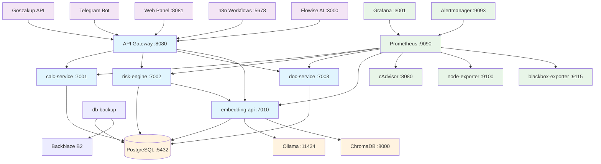

# ZakupAI Architecture

## Overview

ZakupAI is a microservices-based platform for automating government procurement processes in Kazakhstan. The system provides lot analysis, risk assessment, margin calculations, and document generation capabilities.

## System Architecture



## Service Details

### Core Services

| Service           | Port | Purpose                                 | Dependencies                 |
| ----------------- | ---- | --------------------------------------- | ---------------------------- |
| **calc-service**  | 7001 | Financial calculations, margin analysis | PostgreSQL                   |
| **risk-engine**   | 7002 | Risk scoring and assessment             | PostgreSQL, embedding-api    |
| **doc-service**   | 7003 | Document generation, TL;DR              | PostgreSQL, embedding-api    |
| **embedding-api** | 7010 | Vector embeddings and search            | PostgreSQL, Ollama, ChromaDB |

### Infrastructure

| Service     | Port | Purpose                            |
| ----------- | ---- | ---------------------------------- |
| **gateway** | 8080 | Nginx reverse proxy, rate limiting |
| **db**      | 5432 | PostgreSQL primary database        |
| **web**     | 8081 | FastAPI web panel                  |
| **bot**     | -    | Telegram bot service               |

### AI Stack

| Service     | Port  | Purpose                                |
| ----------- | ----- | -------------------------------------- |
| **ollama**  | 11434 | Local LLM inference (nomic-embed-text) |
| **chroma**  | 8000  | Vector database for embeddings         |
| **flowise** | 3000  | AI workflow builder                    |
| **n8n**     | 5678  | Workflow automation platform           |

### Monitoring

| Service               | Port | Purpose                         |
| --------------------- | ---- | ------------------------------- |
| **prometheus**        | 9090 | Metrics collection and alerting |
| **grafana**           | 3001 | Dashboards and visualization    |
| **alertmanager**      | 9093 | Alert routing and notifications |
| **cadvisor**          | 8080 | Container metrics               |
| **node-exporter**     | 9100 | Host system metrics             |
| **blackbox-exporter** | 9115 | HTTP endpoint monitoring        |

## End-to-End Data Flow

```mermaid
sequenceDiagram
    participant GZ as Goszakup API
    participant GW as API Gateway
    participant CALC as calc-service
    participant RISK as risk-engine
    participant DOC as doc-service
    participant EMB as embedding-api
    participant DB as PostgreSQL
    participant TG as Telegram Bot
    participant WEB as Web Panel

    Note over GZ,WEB: E2E Lot Analysis Flow

    GZ->>GW: Lot data (JSON)
    GW->>CALC: POST /lots (create lot)
    CALC->>DB: Store lot data
    CALC->>CALC: Match SKUs with prices
    CALC->>GW: POST /calc/calc (margin calculation)
    CALC->>DB: Store finance calculations

    GW->>RISK: POST /risk/analyze
    RISK->>EMB: GET embeddings for lot description
    EMB->>DB: Retrieve/store embeddings
    RISK->>DB: Store risk evaluation
    RISK->>GW: Risk score + factors

    GW->>DOC: POST /tldr (generate summary)
    DOC->>EMB: Semantic search for similar lots
    DOC->>DB: Store document generation log
    DOC->>GW: TL;DR summary

    GW->>TG: Notify hot lots
    GW->>WEB: Display results
```

## Environment Configurations

### Development

- **Ports**: All services exposed directly
- **CORS**: Open for localhost
- **Logging**: Debug level
- **Features**: Swagger UI, Adminer DB tool

### Staging

- **CORS**: Limited to stage domains
- **Monitoring**: Prometheus enabled
- **Features**: Swagger UI for testing
- **Security**: CSRF enabled

### Production

- **CORS**: Strict domain allowlisting
- **Security**: Full CSP, HSTS headers
- **Monitoring**: Full Grafana stack
- **Resources**: Container limits enforced
- **SSL/TLS**: Required for all traffic

## Data Storage

### PostgreSQL Tables

- `lots` - Government procurement lots
- `lot_prices` - SKU price mappings
- `finance_calcs` - Margin calculations
- `risk_evaluations` - Risk assessments
- `embeddings` - Vector embeddings
- `audit_logs` - Security events

### Backup Strategy

- **Frequency**: Daily at 03:00 Asia/Almaty
- **Storage**: Backblaze B2 cloud storage
- **Retention**: 14 days
- **Format**: Compressed SQL dumps with rotation

## Security Features

- **Authentication**: API key-based access control
- **CSRF Protection**: Token-based for web interfaces
- **Input Validation**: Comprehensive Pydantic schemas
- **Audit Logging**: Security event tracking
- **Rate Limiting**: Tiered by environment
- **Container Security**: Non-root users, resource limits

## Monitoring & Alerting

### Key Metrics

- Service health and uptime
- HTTP response times and error rates
- Container resource usage (CPU/Memory)
- Database connection health
- Disk space utilization

### Alert Rules

- Service down > 1 minute
- HTTP 5xx errors > 1 minute
- High CPU usage > 80% for 2 minutes
- High memory usage > 90% for 2 minutes
- Low disk space < 10%

______________________________________________________________________

**Last Updated**: August 30, 2024
**Version**: 1.0.0
